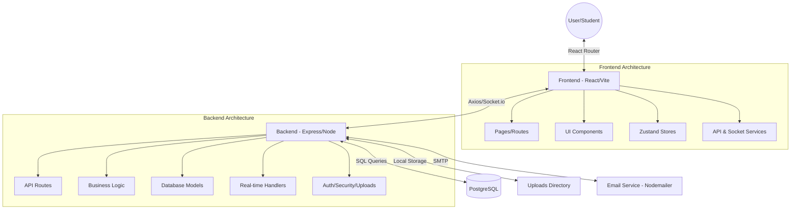

# 🧠 Project Memory Map: StudyHub

This document provides a conceptual and structural map of the StudyHub project to help developers navigate and understand the codebase quickly.

## 🏗️ Architectural Overview

## 🛠️ Technology Stack

| Layer | Technology | Purpose |
|-------|------------|---------|
| **Frontend** | React 18, Vite | Framework and Build Tool |
| **Styling** | TailwindCSS, Lucide React | Visual Design and Icons |
| **State** | Zustand | Global State Management |
| **Query** | TanStack Query | Server State and Data Fetching |
| **Backend** | Node.js, Express | Server Runtime and Framework |
| **Real-time** | Socket.io | Bidirectional Communication |
| **Database** | PostgreSQL | Relational Data Storage |
| **Security** | JWT, bcrypt, Helmet | Auth and Security Headers |
| **Testing** | Jest, Supertest | Verification and Quality |

## 📂 Structural Map

### Root Directory
- `/client` - React frontend application.
- `/server` - Express backend application.
- `/uploads` - Storage for user-uploaded notes and assignments.
- `package.json` - Workspace configuration (monorepo).

### Backend (`/server/src`)
- `config/` - Database connection and application settings.
- `controllers/` - Functions that handle API requests (Auth, User, Upload, Message).
- `models/` - Data access layer (User, Message, Room models).
- `routes/` - API endpoint definitions.
- `middleware/` - Authentication checks, validation, and file upload processing.
- `services/` - Reusable logic (Email, Notification).
- `socket/` - Real-time event handlers for chat and notifications.
- `database/` - SQL schema and migration scripts.

### Frontend (`/client/src`)
- `pages/` - Top-level route components (Dashboard, Profile, Chat, Rooms).
- `components/` - Reusable UI elements (Navbar, Modals, Feed).
- `stores/` - Zustand stores (authStore, messageStore).
- `services/` - HTTP client wrappers and Socket.io setup.
- `App.jsx` - Main routing and layout configuration.

## 🔄 Core Data Flows

1. **Authentication**: 
   - Registration -> Email Verification -> Login -> JWT Token -> Protected Routes.
2. **File Sharing**: 
   - Upload -> Multer Middleware -> Local Storage -> Database Entry -> Global Feed.
3. **Real-time Messaging**: 
   - Socket Connect -> Join Conversation -> Send Message -> Backend Broadcast -> Frontend Store Update.
4. **Anonymous Study**: 
   - Create Room -> Join with Random Identity -> Ephemeral Chat -> Room Expiry.

## 🔑 Key Concepts
- **Soft Deletes**: Content is marked as deleted but preserved in the DB for recovery.
- **Role-Based Access**: Permissions vary for Students, Teachers, and Admins.
- **Privacy Controls**: Files can be Public, Private (owner only), or Unlisted (link only).
