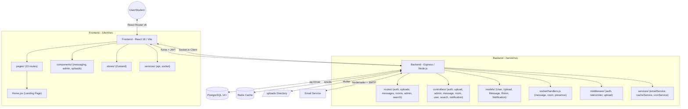

# 🧠 Project Memory Map: STUDYHUB

This document is the living architectural reference for the StudyHub codebase. Update it whenever a new service, layer, or major component is added.

**Last Updated:** April 26, 2026 | **Version:** 1.5.0

---

## 🏗️ Architectural Overview



---

## 🛠️ Technology Stack

| Layer | Technology | Version | Purpose |
|-------|------------|---------|---------|
| **Frontend Framework** | React | 18 | UI Library |
| **Build Tool** | Vite | 7 | Dev Server & Bundler |
| **Styling** | TailwindCSS | 3.4 | Utility-first CSS |
| **Icons** | Lucide React | 0.303 | SVG Icon Set |
| **Charts** | Recharts | Latest | Admin Analytics |
| **State (Global)** | Zustand | 4.4 | Auth, Messages, Notifications |
| **State (Server)** | TanStack Query | 5 | Data Fetching & Caching |
| **HTTP Client** | Axios | 1.6 | API Communication |
| **Real-time (Client)** | Socket.io Client | 4.7 | Live Chat & Presence |
| **Backend Runtime** | Node.js | 18+ | Server Runtime |
| **Backend Framework** | Express | 4.18 | HTTP Framework |
| **Real-time (Server)** | Socket.io | 4.7 | WebSocket Events |
| **Database** | PostgreSQL | 14+ | Primary Data Store |
| **Cache** | Redis + ioredis | Latest | Performance Cache |
| **Auth** | JWT + bcryptjs | - | Stateless Auth + Hashing |
| **File Upload** | Multer | 1.4 | Multipart Form Handling |
| **Email** | Nodemailer | 7 | SMTP Email Dispatch |
| **Scheduling** | node-cron | 4 | Daily Digest Jobs |
| **Security** | Helmet, express-rate-limit | - | Headers & Rate Limiting |
| **Validation** | express-validator | 7 | Input Sanitization |
| **Testing** | Jest + Supertest | - | Unit & Integration Tests |
| **Animations** | Framer Motion | Latest | Micro-animations & Transitions |
| **AI Suite** | Google Gemini AI | Pro | Smart Summaries & Insights |
| **Testing/Demo** | Mock DB Layer | v1.5.0 | Virtual Data for Dev/Demo |
| **PWA** | vite-plugin-pwa | - | Installable Web App |

---

## 📂 Directory & File Map

```
STUDYHUB/
├── client/                          # React Frontend
│   ├── src/
│   │   ├── App.jsx                  # Root router + auth logic
│   │   ├── main.jsx                 # React DOM entry point
│   │   ├── index.css                # Global styles
│   │   ├── pages/
│   │   │   ├── Login.jsx            # ✅
│   │   │   ├── Register.jsx         # ✅
│   │   │   ├── VerifyEmail.jsx      # ✅
│   │   │   ├── ForgotPassword.jsx   # ✅
│   │   │   ├── ResetPassword.jsx    # ✅
│   │   │   ├── Dashboard.jsx        # ✅
│   │   │   ├── Browse.jsx           # ✅ (Search & Filter)
│   │   │   ├── Messages.jsx         # ✅ (Full chat UI)
│   │   │   ├── AnonymousRooms.jsx   # ✅
│   │   │   ├── MyProfile.jsx        # ✅
│   │   │   ├── PublicProfile.jsx    # ✅
│   │   │   ├── Leaderboard.jsx      # ✅ (Rankings & Badges)
│   │   │   └── AdminDashboard.jsx   # ✅ (Stats, Users, Content, Reports)
│   │   ├── components/
│   │   │   ├── messaging/           # ✅ ChatArea, Sidebar, Layout
│   │   │   ├── admin/               # ✅ UserManagement, ContentManagement, ReportManagement
│   │   │   ├── dashboard/           # ✅ RecommendationSection
│   │   │   └── layout/              # ✅ Navbar, NotificationBell
│   │   ├── stores/
│   │   │   ├── authStore.js         # ✅ JWT, user session
│   │   │   └── messageStore.js      # ✅ Conversations, messages
│   │   └── services/
│   │       ├── api.js               # ✅ Axios instance + interceptors
│   │       └── socket.js            # ✅ Socket.io client
│   ├── vite.config.js               # ✅ PWA, proxy to :5000
│   └── package.json
│
├── server/                          # Node.js Backend
│   ├── src/
│   │   ├── index.js                 # ✅ Express + Socket.io bootstrap
│   │   ├── config/
│   │   │   ├── database.js          # ✅ pg Pool config
│   │   │   ├── database-mysql.js    # ✅ MySQL fallback
│   │   │   ├── socket.js            # ✅ Socket.io CORS init
│   │   │   └── index.js             # ✅ All env vars (DB, JWT, Email, Redis, AWS)
│   │   ├── controllers/
│   │   │   ├── authController.js    # ✅ Register, Login, Verify, Reset
│   │   │   ├── uploadController.js  # ✅ CRUD + Redis Cache + Ratings + Bookmarks
│   │   │   ├── messageController.js # ✅ Conversations, Messages, Attachments
│   │   │   ├── roomController.js    # ✅ Anon Rooms CRUD
│   │   │   ├── userController.js    # ✅ Public Profile, Uploads by user
│   │   │   ├── adminController.js   # ✅ Stats + Redis Cache, Trends, Users, Reports, Uploads
│   │   │   ├── searchController.js  # ✅ Cross-entity search
│   │   │   ├── notificationController.js # ✅ In-app notifications
│   │   │   ├── leaderboardController.js # ✅ Achievement ranks & badge logic
│   │   │   ├── recommendationController.js # ✅ Personalized AI content suggestions
│   │   │   └── aiController.js       # ✅ Smart document summarization orchestration
│   │   ├── models/
│   │   │   ├── User.js              # ✅
│   │   │   ├── Upload.js            # ✅
│   │   │   ├── Message.js           # ✅
│   │   │   ├── Room.js              # ✅
│   │   │   └── Notification.js      # ✅
│   │   ├── routes/
│   │   │   ├── index.js             # ✅ Route aggregator
│   │   │   ├── authRoutes.js        # ✅
│   │   │   ├── uploadRoutes.js      # ✅
│   │   │   ├── messageRoutes.js     # ✅
│   │   │   ├── roomRoutes.js        # ✅
│   │   │   ├── userRoutes.js        # ✅
│   │   │   ├── adminRoutes.js       # ✅ + /trends endpoint
│   │   │   ├── searchRoutes.js      # ✅
│   │   │   ├── notificationRoutes.js # ✅
│   │   │   ├── leaderboardRoutes.js  # ✅
│   │   │   ├── recommendationRoutes.js # ✅
│   │   │   └── aiRoutes.js           # ✅
│   │   ├── middleware/
│   │   │   ├── auth.js              # ✅ authMiddleware, requireAdmin
│   │   │   ├── rateLimiter.js       # ✅ apiLimiter, authLimiter, uploadLimiter
│   │   │   └── upload.js            # ✅ Multer config
│   │   ├── services/
│   │   │   ├── emailService.js      # ✅ Welcome, Verify, Reset, Digest
│   │   │   ├── cacheService.js      # ✅ Redis get/set/del/delPattern
│   │   │   ├── cronService.js       # ✅ Daily digest scheduler
│   │   │   └── aiService.js         # ✅ Google Gemini + PDF Extraction
│   │   ├── socket/
│   │   │   └── handlers.js          # ✅ setupMessageHandlers, setupRoomHandlers, setupPresenceHandlers
│   │   ├── database/
│   │   │   ├── schema.sql           # ✅ PostgreSQL schema (20+ tables)
│   │   │   ├── schema-mysql.sql     # ✅ MySQL equivalent
│   │   │   ├── setup.js             # ✅ DB init + admin seed
│   │   │   ├── setup-mysql.js       # ✅ MySQL init
│   │   │   └── mockDb.js            # ✅ Virtual DB layer for demo/dev (v1.5.0)
│   │   └── tests/
│   │       ├── health.test.js       # ✅
│   │       └── auth.test.js         # ✅
│   └── package.json
│
├── docs/                            # ✅ Organized Documentation
│   ├── INDEX.md                     # ✅ Navigation hub
│   ├── api/                         # API reference
│   ├── db/                          # Database guides
│   ├── deploy/                      # Deployment docs
│   ├── history/                     # Phase completion logs
│   ├── project/                     # Project maps & roadmap
│   └── setup/                       # Setup guides
│
├── docker-compose.yml               # ✅ PostgreSQL + pgAdmin
├── .env.example                     # ✅ All env vars documented
├── package.json                     # ✅ Monorepo workspace config
└── railway.json                     # ✅ Railway deployment config
```

---

## 🔄 Core Data Flows

### 1. Authentication
```
Register → Email Verification Token → sendVerificationEmail()
         → /verify-email?token=X → JWT issued → localStorage
         → Axios interceptor attaches Bearer token to all requests
```

### 2. File Upload & Caching
```
POST /api/uploads → Multer (multipart) → Local /uploads dir
                  → uploadController.createUpload()
                  → INSERT INTO uploads
                  → cacheService.delPattern('uploads:*')   ← cache invalidated
                  → Notification created → Socket emit
```

### 3. Feed / Browse (Cached)
```
GET /api/uploads?subject=math → cacheService.get(key)
    ├── HIT  → return JSON immediately (< 1ms)
    └── MISS → Upload.getAll() → DB query
             → cacheService.set(key, result, 300s)
             → return JSON
```

### 4. Real-time Messaging
```
Socket connect + auth → setupMessageHandlers()
User sends message → POST /api/messages/send
                   → DB insert → io.to(conversationId).emit('new_message')
                   → MessageStore update → UI re-render
```

### 6. AI Recommendations
```
GET /api/recommendations → Get user interaction history (downloads)
                         → Find top 3 frequent subjects
                         → Fetch top-rated uploads in those subjects (not yet downloaded)
                         → Fallback to global trending if no history
                         → Cache result (1 hour)
```

### 7. Smart PDF Summarization
```
POST /api/ai/summarize/:id → Extract text from PDF using pdf-parse
                           → Send prompt to Gemini API (gemini-pro)
                           → Format response (Overview + Key Takeaways)
                           → Cache result (24 hours)
```

### 8. Gamification (Leaderboard & Badges)
```
GET /api/leaderboard → Aggregate scores (Uploads*10 + RatingsAvg*5)
                     → Calculate Badges (e.g., 'Rising Star' for 5 uploads)
                     → Cache result (30 minutes)
                     → Display in Leaderboard UI + Achievement Showcase
```

### 9. Mock Database Initialization (v1.5.0)
```
Server Start → Check process.env.USE_MOCK_DB
             ├── true  → Initialize mockDb.js (Virtual JSON Store)
             │         → Intercept database pool queries
             │         → Return static demo data (Users, Rooms, Messages)
             └── false → Connect to live PostgreSQL / Redis
```

---

## 🔑 Key Concepts

| Concept | Description |
|---------|-------------|
| **Soft Deletes** | `is_deleted = TRUE` — content is hidden but recoverable |
| **Role-Based Access** | `student` / `teacher` / `admin` — enforced by `requireAdmin` middleware |
| **Privacy Controls** | Uploads: `public` / `private` / `unlisted` |
| **Cache-Aside Pattern** | Read from cache first; on miss, fetch from DB and populate cache |
| **Cache Invalidation** | Write operations explicitly `del()` or `delPattern()` related cache keys |
| **Graceful Degradation** | `cacheService` silently no-ops if Redis is not configured |
| **Token Expiry** | JWT: 7 days. Email verify token: 24h. Password reset token: 1h |
| **Rate Limits** | API: 100/15min. Auth: 10/15min. Uploads: 20/hour |


